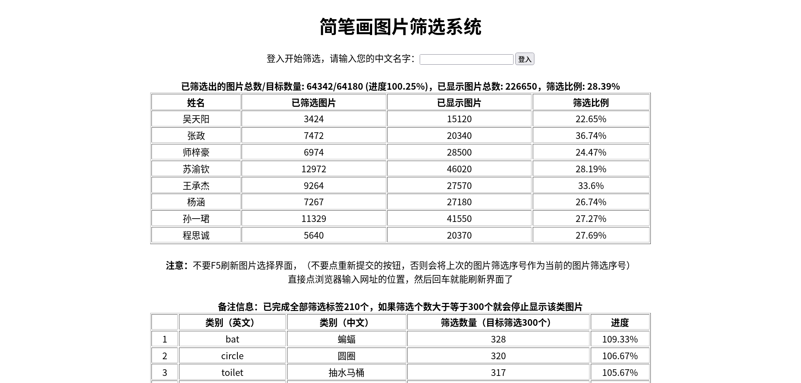
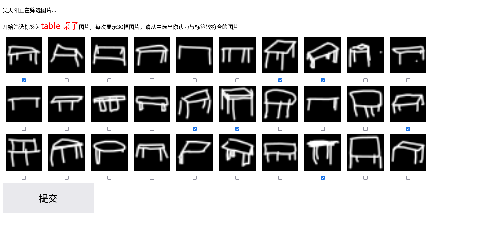
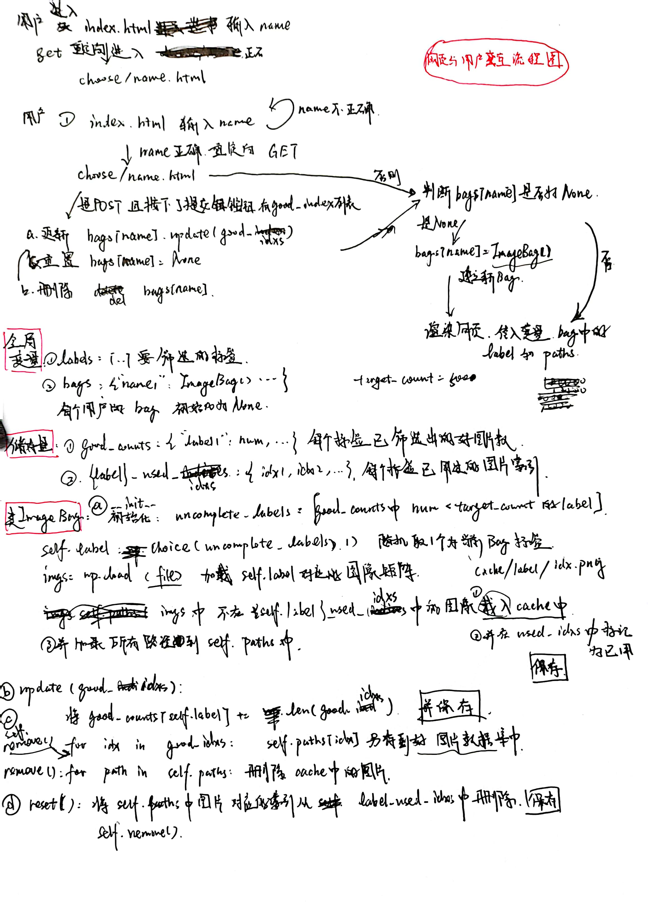

# 网页图片筛选系统

思路：用Python中的Flask包，实现网页中图片现实和与Python内部函数的交互，从而实现多用户同时对数据集中不同类别的图片进行筛选。

注：Flask包版本为`2.2.2`

### 使用方法

```shell
python app_filter.py
```

运行上述代码即可在本地局域网上创建筛选系统，筛选系统具有两个链接，127开头的为本地链接，192开头的为局域网链接，让其他用户加入到当前局域网下，连接局域网链接即可进入系统。

### 文件说明

（该系统流程图草图见网页最下方）

1. `app_filter.py`：Flask包网页生成主程序，包含三个网页（下文中的`IP`表示用户登陆所用的IP地址链接）
   - `IP/`：用户进入系统、查看全局信息的网页（根网页），网页模板位于[./templates/index.html](./templates/index.html)。
   - `IP/choose/<name>`：用户的用户名为name，显示当前用户的可选图片，网页模板位于[./templates/choose.html](./templates/choose.html)。
   - `IP/reset`：用于重置所有用户的图片，一般只在关闭服务器前使用，避免当前用户显示的图片但用户还未标记导致图片损失。
2. `imagebag.py`：其中包含项目的核心类 `ImageBag`，我们将一个用户网页上显示的图片集合称为一个图片包，`ImageBag` 用于处理一个图片包的中图片的选择、加载到缓存、标记、删除。
3. `mark.py`：其中包含类 `Mark`，用于记录以筛选的图片数、总目标图片数、每个用户已筛选的图片数/以显示的图片数。
4. `constant.py`：存储各种常量信息，包括
   - 路径：**完整数据集路径`PATH_DATASET`（在不同机器上运行需要指定当前数据集位置）**，图片缓存路径、日志文件保存路径、筛选后的图片存放路径。
   - 常量：用户名列表，每个类别目标筛选个数，网页中显示行数和列数。

5. `translate_eng_to_chn.py`：将标签从英文翻译成中文，并存储到json文件 [eng_to_chn.json](../archives/eng_to_chn.json) 中。

### 网页执行效果

#### 全局状态界面（部分）

完整界面图片请见 [../archives/figures/全局状态界面.png](../archives/figures/全局状态界面.png) （完成全部筛选的状态）



### 用户筛选界面



交互系统基本交互原理和变量存储的相关说明如下图所示：

