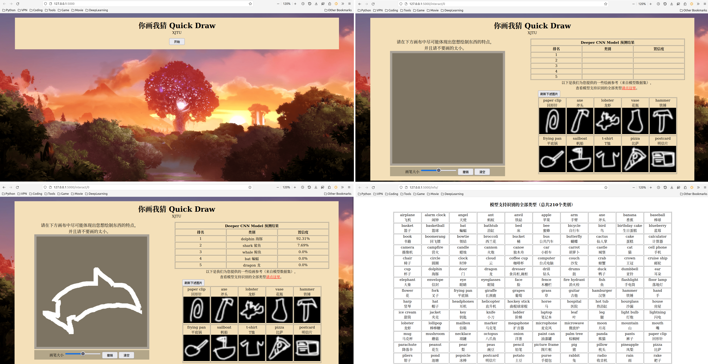
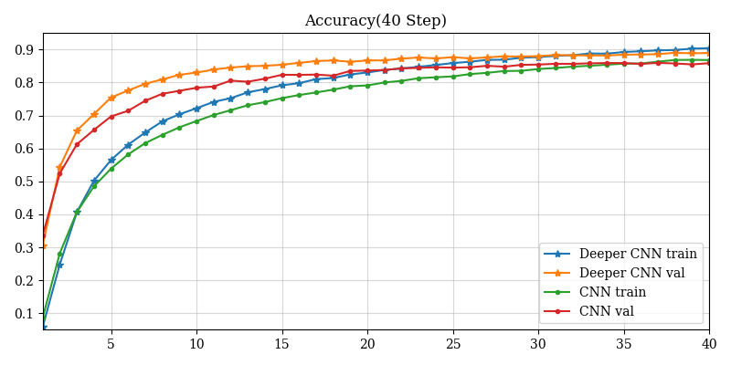
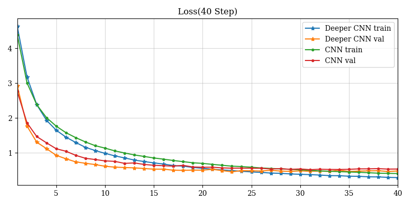
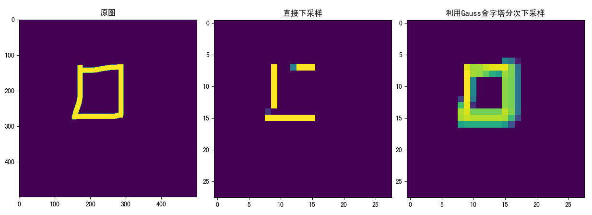

# 你画我猜在线交互系统

## 项目目标

搭建网页，通过网页上进行绘画，实时返回绘制图像的预测结果。

## 数据集

- [345个类别的enpy二进制编码完整数据集 - Google Cloud](https://console.cloud.google.com/storage/browser/quickdraw_dataset/full/numpy_bitmap;tab=objects?prefix=&forceOnObjectsSortingFiltering=false)
- [quickdraw-dataset - GitHub](https://github.com/googlecreativelab/quickdraw-dataset#get-the-data) GitHub上的quickdraw数据集介绍
- [Google Drive下载 - quick draw dataset_selected](https://drive.google.com/drive/folders/1FXPqyCMXBtB0EkbUv5cR7JrTUbnAh0vq?usp=sharing)：我们小组人工筛选出的最终数据集，筛选的具体细节请见下文

## 在线交互系统使用方法

该系统支持在局域网上进行多人实时图像识别，**Python version>=3.8**，包安装方法：

```shell
pip install -r requirements.txt
```

- **模型权重放置**：先将模型的权重文件（[Google Drive 下载 ](https://drive.google.com/drive/folders/1N_CEtCTLXtQ5JMbXsLFV9_-tjSnrf0OQ?usp=sharing)）将两个文件直接放到 [/models/deeper_cnn_model/training/](models/deeper_cnn_model/training/training.part1.rar) 文件夹下
- **筛选后的数据集放置**：将下载好的筛选后的[数据集 `quick_draw_dataset_selected.zip`](https://drive.google.com/drive/folders/1FXPqyCMXBtB0EkbUv5cR7JrTUbnAh0vq?usp=sharing)文件夹 `dataset_selected` 直接放到根目录下，放置好的图片位置应该是 `/dataset_selected/label_name/id.png`


最后**进入目录 `/interact_html/` 后**执行

```shell
cd ./interact_html
python app.py
```

即可在局域网上启动服务器。效果图如下：（全部单张效果图[archives/figures/display](archives/figures/display)）



## 项目流程说明

### 预处理

[archives/eng_to_chn.json](./archives/eng_to_chn.json)：将345个标签从英文转为中文的json索引，可以用一下代码将json读取为Python中的字典：（该文件生成的代码在[./filter/translate_eng_to_chn.py](./filter/translate_eng_to_chn.py)）

```python
import json
with open("eng_to_chn.json", "r", encoding="utf-8") as file:
    json.load(file)
```

[filter/](./filter)：该文件夹下存储了**网页图片筛选系统**项目所用的全部代码，需要结合`./archives`中的配置文件`eng_to_chn.json`和`target_labels.txt`使用。由于原始数据集中存在大量不精确图片，该项目是为筛选数据集所建立的网页筛选系统，**支持多人在同一局域网下，同时筛选数据集中不同类别下的图片**。

[Google Drive下载 - quick draw dataset_selected](https://drive.google.com/drive/folders/1FXPqyCMXBtB0EkbUv5cR7JrTUbnAh0vq?usp=sharing)：我们小组人工筛选出的最终数据集，**包含210个类别总共64341张图片**，由于部分标签难以通过简笔画绘制，所以我们又从全部的347个类别中选出**210个类别**（类别名文件：[target_labels.txt](./archives/target_labels.txt)）作为我们的筛选的目标类别，其中**每个类别**我们筛选至少**300张图片**。

### 卷积神经网络模型

我们总共训练了两个卷积神经网络，我们分别称其为CNN和DeeperCNN，参考经典深度卷积神经网络VGG的思路，从其28x28分辨率层开始，每个卷积块使用多层3x3卷积（padding为1，保持前后图像大小不变）并用2x2的最大池化层进行池化（图像缩小一倍），总共使用两个卷积块，使图像最终大小变为7x7，然后使用两个1024个神经元的全链接层，最后输出层为210维向量。

并且每个图像在输入时候，进行了4种图像增强：随机水平翻转（0.5概率），随机旋转$(-15^\circ,15^\circ)$，随机平移$(-10\%,10\%)$，随机亮度变换$(-30\%,30\%)$。

两个模型区别在于deeper CNN在原有CNN基础上每个卷积块都增加了一个卷积层，达到3个，并将第二个卷积块中每个卷积层增大一倍到256，并加入了随机亮度变换（可视化模型结构请见[CNN.png](models/cnn_model/model.png)和[deeper CNN.png](models/deeper_cnn_model/model.png)）

激活函数：除最后一个输出层是softmax，其他都是relu。

损失函数：交叉熵损失。

优化器：Adam，步长$10^{-4}$。

Batch大小：CNN为32，DeeperCNN为48。





```
训练日志:

CNN:
epoch=29: train/val准确率top1:83.57%/85.38%,top5: 97.75%/97.74%,loss=0.5505/0.5423
epoch=60: train/val准确率top1:90%,86.98%,top5: 99.44%/98.25%,loss=0.2996/0.5395
从曲线上可以看出，val的loss已经不再下降，说明已经发生过拟合，但是val的loss也没有明显上升，说明过拟合并不严重

Deeper CNN
epoch=40 训练集/测试集 top1=90.44%/89% top5=99.36%/98.78% loss=0.2918
```

其中top1表示预测中第一个类别预测准确率，top5表示预测中排名前五个类别预测的准确率。

### 交互网页设计

由于第一次设计复杂的交互网页，要从网上学习非常多的HTML，CSS，JS知识，并且有chatgpt在JS代码编写上的帮助，成功实现通过在socket库实现网页与Python进行实时交互，且不刷新网页。

网页设计主要分为以下几个部分：

1. 画版设计，通过`canvas`实现网页上的在线画版。
2. 通过`socket`库编写Python和Js代码，设计`socket.emit('接口', '传输内容(字典)')`向Python传输的图像结果，反向向HTML发送预测结果和一些图片样例。我们首先实现了画版绘制的图片实时现实在网页上，再实现了表格的绘制（用于实时现实预测结果），最后实现了在表格中现实了图片文本的分行现实。
3. 最后为了实现网页的多用户同时使用，每个用户绘制的图片不冲突，实现了了`Manager`类，用于管理每个`User`类，在`User`类下，每个用户有唯一`id`（由`Manager`分配），图片样例的存储地址（需要从全部的图片中随机选择，并将图片移动到用户路径下）和用户当前绘制图片的保存。

工程上的难点主要就是对Js的不熟练，而技术上主要遇到了两个问题：

1. `canvas`生成的是四通道图片，第四通道为图片透明度，无法直接通过 `Image.convert('L')` 转化为灰度图片，由于图像只有黑白，所以最后通过提取出第四通道，并做`log(x+1)`变换得到灰度图片。

2. 网页中的画版是`500x500`像素，而模型输入大小是`28x28`像素，尝试直接使用双线性插值将维到`500x500`图片发生较大的失真，所以我们考虑了类似Guass金字塔的思路，对图像进行分次下采样，每次缩小图像一般的像素，如下所示：

   
